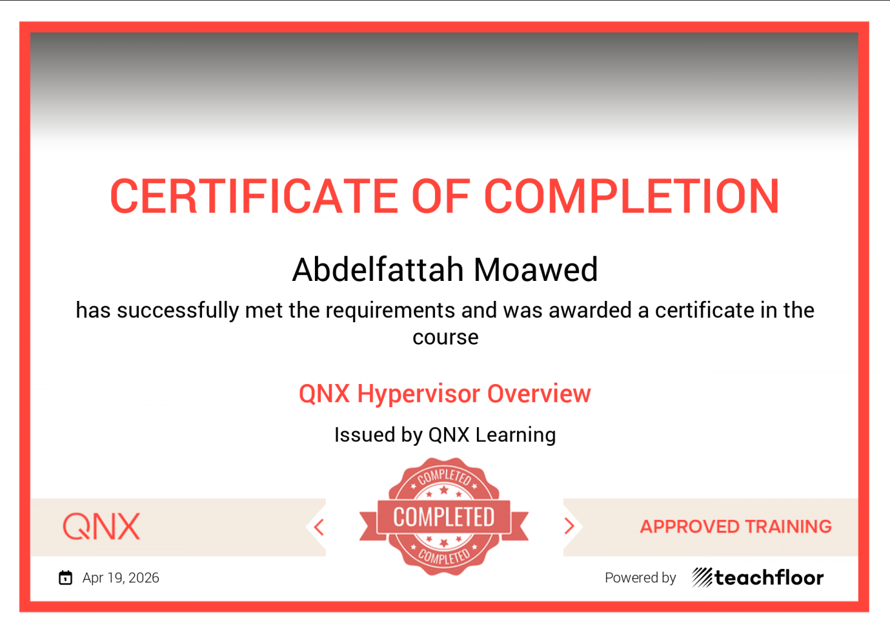

# QNX Hypervisor Overview Playground 

Welcome to the **QNX Hypervisor Overview Playground**! This repository serves as a comprehensive, step-by-step guide and knowledge base for understanding the architecture, features, and inner workings of the QNX Hypervisor.

Whether you are exploring virtualized embedded environments, dealing with safe states, or managing guest-host communications, you'll find detailed breakdowns of core concepts across these modules.

## 📜 Table of Contents

This playground is divided into several focused topics to help you master the QNX Hypervisor step-by-step:

1. [**Architecture**](01-Architecture.md) - Deep dive into the foundational architecture of the QNX Hypervisor.
2. [**Devices**](02-Devices.md) - Understanding virtualized and pass-through devices.
3. [**Run Guest Code**](03-Run-Guest-code.md) - Mechanics of executing guest operating systems and code.
4. [**Guest-Host Communication**](04-Guest-Guest-Host-Communication.md) - How guests interact with each other and the host OS.
5. [**Shared Memory**](05-shared-Memory.md) - Mechanisms for sharing memory across boundaries.
6. [**Interrupts & Timers**](06-interrupt.md) & [*(Timers)*](06-timer.md) - Handling hardware/software interrupts and timers in a virtualized environment.
7. [**Which QNX To Run On**](07-Which-QNX-To-Run-On.md) - Guidelines for choosing the right base OS for your hypervisor.
8. [**Design Safe State (DSS)**](08-Design-safe-state-DSS.md) - Safety critical design patterns and fail-safe states.
9. [**IOMMU & DMA**](09-IOMMU-DMA.md) - Managing memory management units and direct memory access safely.
10. [**Watchdogs**](10-Whatchdogs.md) - Implementing watchdogs to monitor system health and guests.
11. [**Other Issues & Solutions**](11-Other-Issues-and-Solutions.md) - Common pitfalls, troubleshooting, and best practices.

## 🏆 Certification

*Created by Abdelfattah Feel free to star ⭐ this repository if you found it helpful!*
